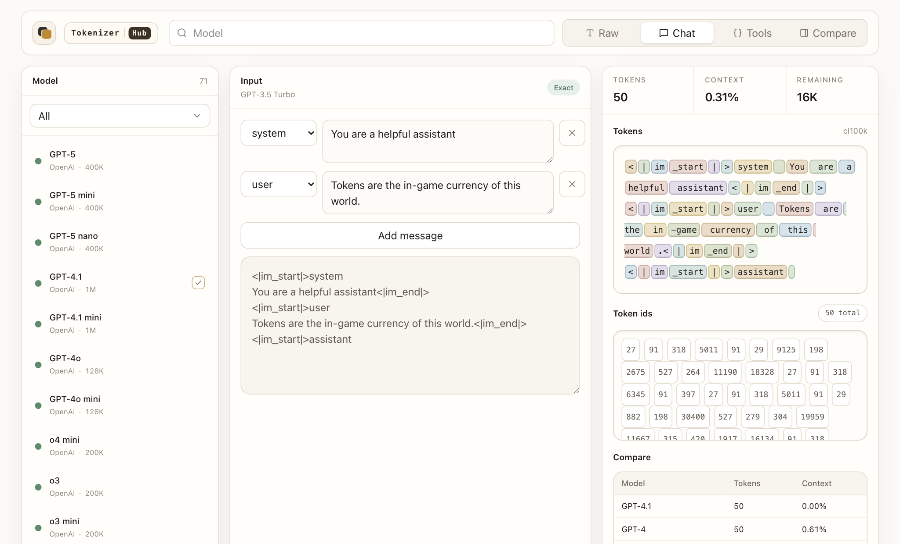

# Tokenizer Hub

语言：[English](README.md) | 简体中文

Tokenizer Hub 是一个简洁的 tokenizer 工作台，用于比较现代 AI 模型的 token 使用情况，并加强了对中国模型家族的覆盖。

体验地址：

```text
https://tokenizer.haoqi.xin/
```



产品刻意保持简单：界面不提供导出或下载，不下载模型权重，不做后台同步任务，也不为不支持的 tokenizer 提供估算 token 数。

## 核心功能

- 在少于 300 个模型的精选模型目录中搜索和切换模型。
- 对比所选模型的 token 数量。
- 支持 raw prompt、chat message、tool-call 和 comparison 工作流。
- 显示所选模型的上下文使用量和剩余上下文。
- 只使用精确 tokenization。没有支持 tokenizer 的模型不会进行计算。
- 后端预加载 tokenizer artifacts，避免前端加载 tokenizer 词表文件。

## 模型目录

前端模型快照位于 `src/data/models.ts`；后端 tokenizer 注册表快照位于 `backend/catalog.json`。

模型目录覆盖 OpenAI、Anthropic、Google、Qwen、DeepSeek、Moonshot/Kimi、Z.ai、MiniMax、小米、Meta、Mistral、xAI、百度、腾讯、字节跳动、Cohere 等代表性模型。

目录也保留了一些已经下架但仍有研究和对比价值的历史重要模型，例如 GPT-3.5、text-davinci 和 Llama 2。

运行模型目录校验：

```bash
pnpm validate:models
```

该校验会检查模型列表是否低于配置的数量上限，并确认关键请求模型仍然存在。

## 架构

```text
src/app/page.tsx                    主客户端 UI 和交互状态
src/data/models.ts                  前端模型目录快照
src/lib/tokenizer.ts                Prompt 渲染和显示格式化
src/lib/tokenizer-api.ts            后端 tokenizer API 客户端
backend/app/main.py                 FastAPI tokenizer 服务
backend/app/tokenizer_registry.py   启动预加载和 tokenizer 分发
backend/catalog.json                后端模型到 tokenizer 的注册表
backend/tokenizers/                 本地 tokenizer artifacts
docs/backend-design.md              后端和 tokenizer artifact 设计说明
scripts/                            模型目录、tokenizer 和 UI 校验脚本
```

### 前端

前端使用 Next.js App Router、React、Tailwind CSS 和 lucide-react icons 构建。UI 刻意保持紧凑、少解释，更接近工具型界面，而不是营销页面。

### 后端

后端是 FastAPI 服务。它在启动时预加载所有配置的 tokenizer artifacts，然后向前端返回精确的 token ids 和 prompt segment 映射。

Tokenizer artifacts 存储在 `backend/tokenizers/` 下。Hugging Face 的 `tokenizer.json` 文件会压缩为 `tokenizer.json.gz`；Kimi tokenizer 使用官方 `tiktoken.model` 和 `tokenizer_config.json`。

项目只存储 tokenizer 文件，不下载完整模型权重。

## 开发

安装依赖：

```bash
pnpm install
```

启动前端：

```bash
pnpm dev
```

启动后端：

```bash
pnpm backend
```

运行检查：

```bash
pnpm validate:models
pnpm validate:tokenizer-reuse
pnpm validate:segments
pnpm lint
pnpm build
```

## 部署

前端和后端均通过 Vercel 部署。

生产地址：

```text
https://tokenizer.haoqi.xin/
```
