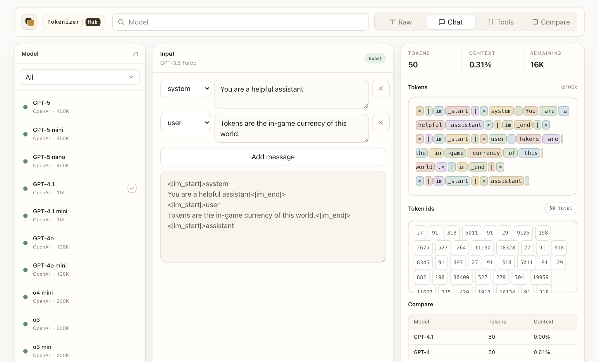

# Tokenizer Hub

语言：[English](README.md) | 简体中文

Tokenizer Hub 是一个简洁的 tokenizer 工作台，用于比较现代 AI 模型的 token 使用情况，并加强了对中国模型家族的覆盖。

体验地址：

```text
https://tokenizer.haoqi.xin/
```



产品刻意保持简单：界面不提供导出或下载，不下载模型权重，不做后台同步任务，不接收远端供应商密钥，也不提供估算 token 数。

## 核心功能

- 在少于 300 个模型的精选模型目录中搜索和切换模型。
- 对比支持当前输入模式的所选模型 token 数量。
- 支持 Raw、Chat、Tools 和 Compare 工作流，并按模式分别声明准确性。
- 显示所选模型的上下文使用量和剩余上下文。
- 只有对应本地路径经过验证时才显示 `Exact Raw`、`Exact Chat` 或 `Exact Tools`；不支持的模式保留可见并标为不可用。
- 后端预加载 tokenizer artifacts，避免前端加载 tokenizer 词表文件。

## 模型目录

前端模型快照位于 `src/data/models.ts`；后端 tokenizer 注册表快照位于 `backend/catalog.json`。

v0.2.0 快照日期为 `2026-08-09`，共 88 条目录记录：其中 86 条具备精确的本地 Raw tokenization；两个尚无官方发布物的 DeepSeek 预览标识仍可搜索，但明确不可用。当前目录覆盖 OpenAI、Google、Qwen、DeepSeek、Moonshot/Kimi、Z.ai、MiniMax、小米、Meta 和 Mistral AI。

本次新增 GPT-5.6 Sol/Terra/Luna、DeepSeek V4 Flash 0731、GLM-5.2、Kimi K3 与 K2.7 Code、MiniMax M3、五个 Gemma 4 指令模型、Llama 4 Scout/Maverick，以及当前 Mistral Small/Medium 代表模型。

目录也保留了一些已经下架但仍有研究和对比价值的历史重要模型，例如 GPT-3.5、text-davinci 和 Llama 2。

运行模型目录校验：

```bash
pnpm validate:models
```

该校验会检查 88 条快照、生命周期、模式能力、资产、默认模型和必需模型 ID。`pnpm validate:evidence` 会独立校验官方来源 URL、固定 revision、artifact SHA-256 和 renderer 证据。

## 架构

```text
src/app/page.tsx                    主客户端 UI 和交互状态
src/data/models.ts                  前端模型目录快照
src/lib/tokenizer.ts                Token segment 展示格式化
src/lib/tokenizer-api.ts            后端 tokenizer API 客户端
backend/app/main.py                 FastAPI tokenizer 服务
backend/app/tokenizer_registry.py   启动预加载和 tokenizer 分发
backend/app/prompt_renderer.py      经过审查的结构化 prompt renderer 注册表
backend/catalog.json                后端模型到 tokenizer 的注册表
backend/tokenizers/                 本地 tokenizer artifacts
data/model-evidence.json            官方来源和 checksum 证据
docs/backend-design.md              后端和 tokenizer artifact 设计说明
scripts/                            模型目录、tokenizer 和 UI 校验脚本
```

### 前端

前端使用 Next.js App Router、React、Tailwind CSS 和 lucide-react icons 构建。UI 刻意保持紧凑、少解释，更接近工具型界面，而不是营销页面。

### 后端

后端是 FastAPI 服务。它先校验 tokenizer manifest，再预加载配置的 artifacts、渲染受支持的结构化请求，并向前端返回权威 serialized text、精确 token IDs 和 segment 映射。

Raw 发送文本；Chat 发送有序消息；Tools 发送有序消息和工具定义。浏览器不再自行拼接权威 chat/tool prompt。v0.2.0 仅对具有 golden fixture 的 Qwen3 8B renderer 声明精确 Chat 和 Tools；其余模型在官方 formatter 完成审查和测试前保持 Raw-only。

Tokenizer artifacts 存储在 `backend/tokenizers/` 下。Hugging Face 的 `tokenizer.json` 文件会压缩为 `tokenizer.json.gz`；Kimi tokenizer 使用官方 `tiktoken.model` 和 `tokenizer_config.json`。

项目只存储 tokenizer 和经过审查的 prompt template，不下载完整模型权重。所有本地 artifact 都固定到来源 revision，并在启动时通过 SHA-256 校验。输入不会发往模型供应商；仅由远端 API 提供的 token count 或 token ID 服务不在本版本范围内。

## 开发

安装依赖：

```bash
pnpm install
```

启动前端：

```bash
pnpm dev
```

启动后端：

```bash
pnpm backend
```

运行检查：

```bash
pnpm validate:models
pnpm validate:evidence
pnpm validate:tokenizer-reuse
pnpm validate:backend-architecture
backend/.venv/bin/python -m unittest discover -s backend/tests -v
pnpm validate:segments
pnpm lint
pnpm build
```

## 部署

前端和后端均通过 Vercel 部署。

生产地址：

```text
https://tokenizer.haoqi.xin/
```
